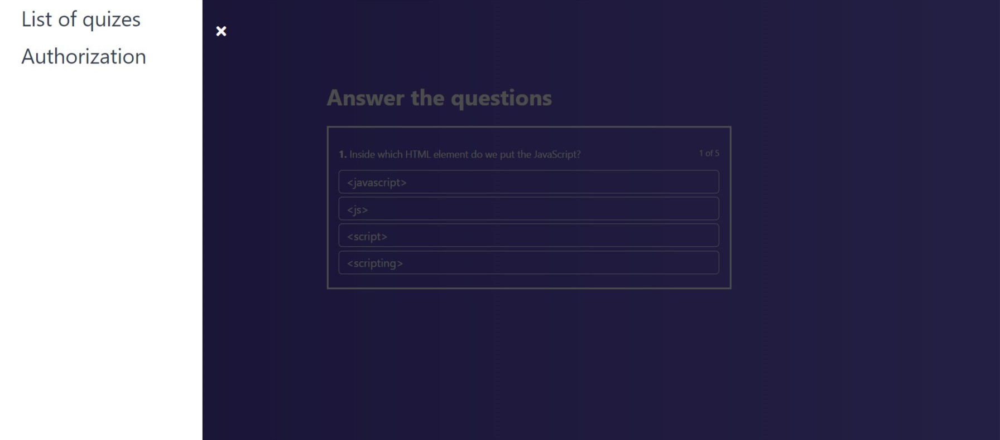

### An application which allowing to run tests and make your own tests. ###

You can try this website by following [link](https://quiz-app-43d12.firebaseapp.com/#/)

----
This application was basen on JavaScript library **React.js** and **Redux**.

Also **react routing** was used.

Opportunities for users:
- All users can run tests even if they are not logged in. 
- You can simply sign up and make your own tests. 

##### In plans #####
- Make this website responsive.

This project was bootstrapped with [Create React App](https://github.com/facebook/create-react-app).

## Available Scripts

### `npm start`

Runs the app in the development mode. 
Open [http://localhost:3000](http://localhost:3000) to view it in the browser.
